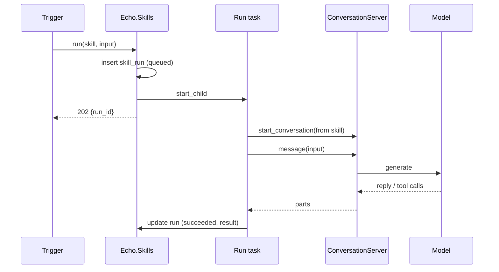
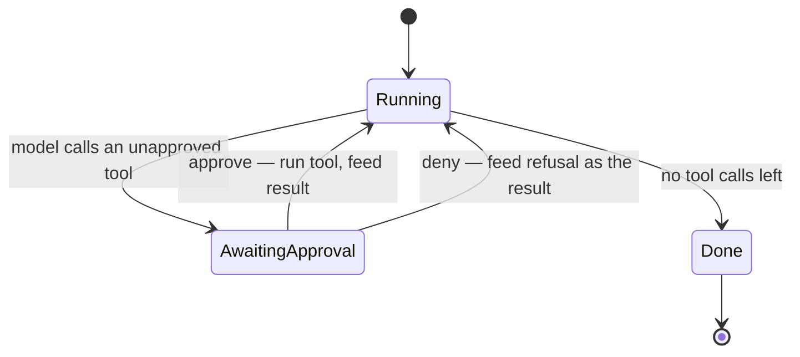
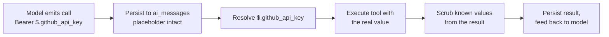
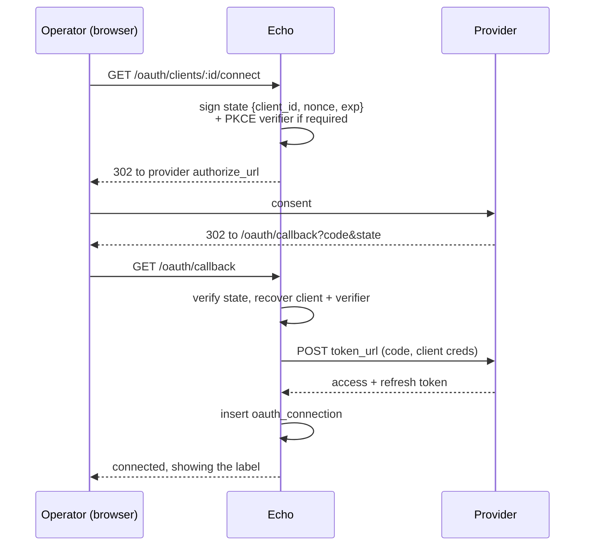
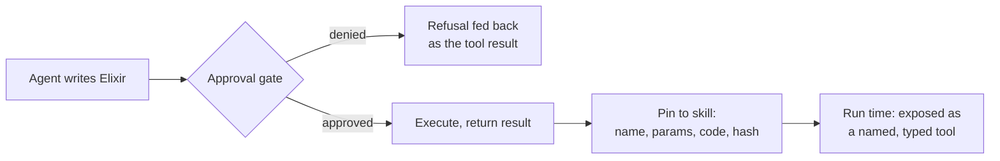

# Skills: repeatable agent work, authored by an agent

> **Status: proposed.** Nothing here is built. Supersedes
> [`designs/agents_builder.md`](./agents_builder.md), which proposed
> DB-defined agents with HTTP-endpoint tools and was never implemented — the
> pieces of it worth keeping are folded in below.

## Context

Echo can hold a conversation with a model that calls tools, and that
conversation now survives a restart. What it cannot do is package a piece of
work so it can be run again later, by something other than a person typing.

`Echo.Agents.Presets` is the closest thing already in the tree: a named system
prompt bundled with its tools and generation settings, exposed at
`POST /api/v1/ai/agents/:name`. But a preset is a module attribute compiled
into the binary (`lib/echo/agents/presets.ex:15`, `:169`), so adding one is a
code change and a deploy, and only Echo's own developers can write one.

A **skill** is a preset that lives in a row: markdown instructions, a list of
tools it is allowed to use, and generation config. It is authored by talking to
a builder agent rather than by editing Elixir, test-run under supervision while
the author approves anything dangerous, and later fired by a trigger.

**Decisions:**

1. **Approval is an authoring-time gate, not a runtime policy engine.** While a
   skill is being written and test-run, the author approves each tool call the
   skill has not already been granted. A finished skill carries its approved
   tools and runs unattended without ever prompting. A tool that deliberately
   halts a run for a human decision may come later; it is not this.
2. **The approved-tool list is a column, not frontmatter.** The markdown body
   carries instructions and may well name parameters for the agent to use —
   best-effort, and fine. The list of tools a skill may actually invoke is the
   security boundary the approval gate exists to enforce, and it will not be
   parsed out of prose that an agent wrote. See [Costs](#costs-and-open-questions).
3. **The builder is an agent with server-side tools**, registered in the
   existing `Echo.Agents.Tools` backend registry (`lib/echo/agents/tools.ex:14`),
   so it inherits the tool loop, persistence, and the approval gate for free.
4. **Runs are Elixir tasks that run to completion.** No job library, no
   retries, no queue. Deployment is single-replica, so there is no contention
   to design around. Durability is a deliberate trade, not an oversight: the
   point of this build is to find out whether the idea works at all, the host
   is stable, and releases are infrequent enough that abandoning the
   occasional in-flight run costs less than a job runner would.
5. **Approval resumes through the conversation resume that already exists.**
   A paused run needs no separate durable state: the model's `functionCall` is
   already in `ai_messages`, and `ConversationServer.init/1` rebuilds a
   conversation from Postgres (`lib/echo/agents/conversation_server.ex:52`).

## What a skill is

Four tables — three per-skill, plus a global secret store. Everything else is
the conversation machinery that already exists. Two more, `oauth_clients` and
`oauth_connections`, arrive with Phase 7; `skill_triggers` arrives with Phase 8
and is left unspecified until then.

```
skills
  id            uuid, primary key
  slug          string, unique      -- ^[a-z0-9-]+$, how a trigger names it
  name          string
  description   text                -- what it does, for listing and picking
  instructions  text                -- the markdown body: the actual SKILL.md
  tools         {:array, :map}      -- approved tool declarations (see below)
  provider      string              -- nil means Gemini, per Echo.Agents.Providers
  model         string
  temperature   float
  max_output_tokens integer
  enabled       boolean
  timestamps
```

`tools` holds exactly what `ai_conversations.tools` holds today, so starting a
conversation from a skill is a straight copy rather than a translation. That
also means a skill inherits provider-shaped tool syntax for free: Gemini
built-ins, OpenRouter server tools, and Echo's own function declarations all
already round-trip through that column.

```
skill_runs
  id            uuid, primary key
  skill_id      references skills
  trigger_id    references skill_triggers, nullable   -- null for a manual run
  session_id    string              -- the ai_conversations / ai_messages id
  status        string              -- queued | running | awaiting_approval
                                    --  | succeeded | failed
  input         map                 -- trigger payload, or the user's instruction
  result        text                -- the final assistant text
  error         text
  started_at, finished_at
  timestamps
```

The run row is a log and an index, not a state machine anyone recovers from.
The conversation is where the actual work is recorded, and `session_id` is the
join to it.

```
skill_variables            -- declaration and binding, written by two paths
  id
  skill_id      references skills
  name          string   -- ^[a-z_][a-z0-9_]*$, referenced as $.name
  kind          string   -- secret | oauth | config | input
  type          string   -- string | number | boolean
  description   text     -- shown to the model and to whoever fills it in
  required      boolean
  position      integer  -- stable ordering for forms
  provider      string   -- kind=oauth: which provider it wants, e.g. "github"

  secret_id     references secrets            -- kind=secret
  connection_id references oauth_connections  -- kind=oauth
  value         text                          -- kind=config: the literal
  timestamps

secrets                    -- global, not per-skill. Phase 6.
  id
  name            string, unique   -- github_api_key
  description     text
  encrypted_value binary
  last_used_at    utc_datetime
  timestamps
```

`input` variables have neither column: their values arrive per run in
`skill_runs.input`.

See [Variables and secrets](#variables-and-secrets) for how these are resolved.

Instructions follow the blog convention of splitting content from metadata
(`lib/echo/content.ex:70`, `lib/echo/content/blog.ex:52`) so that editing a
skill's body is a distinct operation from renaming it — worth having when the
thing writing the body is a model. Revisions are not in scope for Phase 1 but
the split is what makes adding them later cheap.

### Rendering a skill as a file

A skill is exportable as one markdown file, frontmatter plus body, so it can be
read, diffed, and pasted between systems:

```markdown
---
name: weekly-dependency-report
description: Checks our dependencies for new releases and writes a summary.
tools: [http_request]
model: openai/gpt-5.6-luna
provider: openrouter
---

Fetch the latest release for each dependency listed below and summarise
anything that changed...
```

This is a **projection**, in both directions: importing a file writes the
columns. The columns remain authoritative at run time, so a hand-edited
`tools:` line in an exported file grants nothing until it has been imported and
saved.

## Running a skill

A trigger creates a `queued` run, spawns a task, and returns the run id. It
never waits for the model. The existing message path blocks for up to 300s
(`lib/echo/agents/conversation_manager.ex:70`), which is fine for a person at a
keyboard and useless for a webhook.



Starting the conversation is `ConversationManager.start_conversation/1`
(`lib/echo/agents/conversation_manager.ex:37`) with the skill's columns as
opts: `system_prompt` from `instructions`, plus `tools`, `provider`, `model`,
and the generation settings. The skill's markdown becomes the system prompt
verbatim.

Because runs are tasks with no supervision beyond the node, **a restart mid-run
leaves the row stuck in `running`.** That is accepted, not solved: the
conversation itself is durable and readable, so nothing is lost but the status.

## The approval gate

This is the part that needs real design, because today the tool loop cannot
stop.

**Today.** `run_turn/5` calls the provider, persists the reply, and hands to
`continue_turn/7`, which runs every executable call and recurses, up to five
iterations (`lib/echo/agents/conversation_server.ex:150`, `:176`, `:181`). It
all happens inside one `GenServer.call`, and the caller sees only the final
result.

**Proposed.** A conversation gains an approval mode. When it is on, a tool call
whose name is not in the conversation's approved set stops the loop instead of
running.



The key point is that **pausing requires no new durable state.** The model's
`functionCall` is persisted before the loop continues (`store_parts/5` at
`lib/echo/agents/conversation_server.ex:213`, called from `run_turn/5` before
`continue_turn/7`), so the pending call is already in `ai_messages`. A pending
call is simply a `functionCall` in the last model turn with no matching
`functionResponse` — derivable from history, and therefore automatically
correct after a restart, because `init/1` replays that history
(`lib/echo/agents/conversation_server.ex:52`, `replay_into_turns/1` at `:238`).

Resuming is the path that already exists for client-side tools. The
`/conversation/:id/content` endpoint takes `functionResponse` blocks from a
client and continues the loop; approval is the same move with the server
supplying the response:

- **Approve** → run the call through `Echo.Agents.Tools.run/1`
  (`lib/echo/agents/tools.ex:92`), append the resulting `functionResponse`,
  continue.
- **Deny** → append a `functionResponse` whose payload says it was refused, and
  continue. The model gets to react and explain rather than the turn dying,
  and the refusal stays in the audit trail.
- **Approve and remember** → the above, plus write the tool into the skill's
  `tools` column. This is the "flag it as approved" step; from then on the
  skill runs that tool unattended.

Two API shapes fall out, both on the conversation rather than the skill, since
the gate is a conversation capability:

```
GET  /api/v1/ai/conversation/:id/pending      -> calls awaiting a decision
POST /api/v1/ai/conversation/:id/approve      -> {call_id, remember: bool}
POST /api/v1/ai/conversation/:id/deny         -> {call_id, reason}
```

A skill run that pauses moves to `awaiting_approval` and its task ends.
Approving starts a fresh task that resumes the conversation and runs the loop
to completion. Nothing holds a process open across human time.

## Variables and secrets

A skill declares the variables it needs, and the builder agent writes that
schema alongside the instructions. Three kinds:

| Kind | Set by | Resolved from | Example |
|---|---|---|---|
| `secret` | operator, once | the secret store | `$.github_api_key` |
| `config` | operator, once | the `value` column | `$.repo_name` |
| `input` | the trigger, per run | the run's `input` map | `$.issue_number` |

The agent references them by name in tool arguments — `$.github_api_key` — and
the placeholder is resolved **server-side, immediately before the tool runs**.

### Two writers, one row

The builder agent declares what a skill *needs*. Only an operator says what
actually fills it. Those are different privileges: a tool that could do both
could point a skill at any secret in the store, which is the same
privilege-escalation shape as a sub-agent granting itself its parent's tools.

So `skill_variables` is written through two changesets, following the split
already used for blogs (`lib/echo/content/blog.ex:52`, where content is only
writable via `Echo.Content.update_blog_content/2`):

- **`declaration_changeset`** casts `name`, `kind`, `type`, `description`,
  `required`, `position`. This is what the builder agent's tool reaches.
- **`binding_changeset`** casts `secret_id` and `value`, and is reachable only
  from the operator API and UI. No agent tool calls it.

An agent can therefore say *"this skill needs a GitHub token with repo scope"*
and cannot say *"and here is which one to use"*.

**Secrets are global, not per-skill**, because one `github_api_key` is
realistically shared by several skills and rotating it should be one edit
rather than a hunt. That also keeps encryption in a single table, and gives
`last_used_at` somewhere honest to live.

### Defining the schema

The builder agent gets one tool, `define_variables(skill, variables)`, which
replaces the whole declaration set rather than patching it. Declarative is
easier for a model to get right than a sequence of add/update/remove calls, and
it is idempotent when the agent retries.

Replacement keeps bindings for variables whose `name` survives unchanged, and
drops bindings for variables that disappear. The tool result says which
bindings were dropped and which new variables are unbound, so the agent can
tell the operator what still needs filling in — and a skill with unbound
required variables cannot run.

### The model never sees a secret's value

This is the property the whole design hangs on, and it has a specific reason.
Conversation history is persisted to `ai_messages` and replayed into *every*
subsequent model request (`replay_into_turns/1`,
`lib/echo/agents/conversation_server.ex:238`). A secret expanded into a tool
call would therefore be written to Postgres and re-sent to the provider on
every turn for the rest of the conversation. Expanding secrets into the system
prompt is worse for the same reason.

So substitution happens at the last possible moment and is not recorded:



The arguments stored in `ai_messages` keep the placeholder. Only the in-memory
map handed to `Echo.Agents.Tools.run/1` carries the real value, and it is never
written back.

**Results are scrubbed on the way in.** A tool can echo a secret back without
meaning to — an error message quoting the failing URL, a redirect target, a
response body reflecting a header. Before a `functionResponse` is persisted or
shown to the model, the resolved values used in that call are replaced with
their placeholders. This is a backstop, not a guarantee: a secret the tool
transforms — base64-encoded, hashed, embedded in a longer token — will not
match and will not be caught.

### Declaring, validating, failing early

The variable names, kinds, and descriptions are injected into the system prompt
so the agent knows what exists; values never are. A call referencing an
undeclared name comes back as an error result the model can react to, in the
same style as the other tool failures.

Required variables are checked **before the first model call**, when a run
starts. A skill missing its API key should fail immediately with a clear
message, not burn a turn and then fail inside a tool.

The approval UI shows placeholders, exactly as the model wrote them, so
approving a call never displays a secret.

### Interaction with pinned code

Approved code blocks resolve variables in their arguments the same way, so a
block can hold a secret in a local binding. That is intentional — the code is
human-reviewed — but it means a block *can* return a secret, and scrubbing is
what stands between that and the transcript. Blocks that touch secrets deserve
a closer read at approval time than blocks that do not.

## OAuth2 clients and connections

Most integrations do not need this. A GitHub PAT, a Stripe key, a Linear API
key — all of those are just secrets, and Phase 6 covers them. OAuth2 is for
when a provider will not issue a long-lived key, or when Echo must act as an
account rather than as itself. It is a separate phase because it is a separate
subsystem, not a variety of secret.

It has three layers, and conflating them is the usual way this goes wrong:

| Layer | Who does it | How often | Produces |
|---|---|---|---|
| Register the app | operator, on the provider's site | once per provider | `client_id` + `client_secret` |
| Authorize a connection | operator, through a browser flow | once per account | access + refresh token |
| Use and refresh | Echo, at run time | every call | a valid bearer token |

Only the first is manual and out-of-band: someone opens GitHub's developer
settings, creates an OAuth app, pastes the redirect URI Echo shows them, and
brings back a client id and secret. Nothing automates that, and nothing should
pretend to.

```
oauth_clients              -- the registered app
  id
  provider          string, unique    -- github, google, notion
  display_name      string
  client_id         string
  client_secret     binary            -- encrypted
  authorize_url     string
  token_url         string
  default_scopes    {:array, :string}

  -- Provider quirks, as config rather than code. See the costs section.
  auth_style        string   -- basic | body: where client creds go
  scope_delimiter   string   -- " " for most, "," for GitHub
  uses_pkce         boolean
  timestamps

oauth_connections          -- one authorized account
  id
  oauth_client_id   references oauth_clients
  label             string   -- which account this is, for the UI
  access_token      binary   -- encrypted
  refresh_token     binary   -- encrypted, null when the provider issues none
  expires_at        utc_datetime, nullable   -- null means it does not expire
  scopes            {:array, :string}
  status            string   -- active | needs_reauth | revoked
  last_refreshed_at utc_datetime
  timestamps
```

### It reuses the variable machinery

A connection is reached exactly like a secret: a skill declares a variable of
`kind: oauth` with the provider it wants, an operator binds it to a specific
connection, and `$.github` resolves at tool-execution time to a valid bearer
token that is never written to the transcript. All of
[Variables and secrets](#variables-and-secrets) applies unchanged — late
substitution, scrubbing on the way back, placeholders in `ai_messages`.

The write boundary holds too, and matters more here. The agent declares *"this
skill needs a GitHub connection with `repo` scope"*. It cannot choose which
account that is.

### How the agent knows an app exists

A read-only tool, `list_integrations`, returns for each provider: whether a
client is registered, which connections exist by label, and what scopes each
holds. No ids that grant anything, no tokens. This is a tool rather than
something injected into the system prompt because the answer changes between
runs and the builder should look it up when it becomes relevant.

It lets the builder say "there is already a GitHub app, and a connection
labelled `Shonei` with `repo` scope, so I will declare a variable for it"
instead of proposing that you go and create an app you already have.

### Connecting



The redirect URI is **one fixed path**, `/oauth/callback`, because it has to be
registered with the provider ahead of time. Which client a callback belongs to
comes from the signed `state`, which also carries a nonce and an expiry so the
callback cannot be replayed or forged. PKCE verifiers ride alongside it for
providers that require them.

### Refreshing

On resolve, a connection whose `expires_at` is inside a small skew window is
refreshed before use. Two details matter more than the mechanics:

**Concurrent refresh must be serialized.** Two tool calls in one turn can
resolve the same connection at once, both refresh, and — with any provider that
rotates refresh tokens — the loser's token is already invalid, permanently
breaking the connection. Refresh therefore happens inside a transaction holding
`SELECT ... FOR UPDATE` on the connection row. A per-connection GenServer would
match the house style (`Echo.Agents.ConversationRegistry` does exactly that),
but the row lock is simpler and stays correct if a second replica ever exists.

**Refresh failure is terminal, not retryable.** A revoked grant or an expired
refresh token sets `status: needs_reauth` and fails the run with a message
naming the connection. It does not retry, and it does not fall through to an
unauthenticated call.

### The UIs

Three screens, all behind the existing browser basic auth:

- **Clients** — list, create, edit. Shows the redirect URI to paste into the
  provider, and never renders `client_secret` after it is saved.
- **Connections** — per client: labels, scopes, expiry, a `needs_reauth` badge,
  and connect / reconnect / disconnect. This is where a broken integration
  becomes visible, so it is the screen that matters when a 3am run fails.
- **Binding** — on the skill, the operator picks which connection fills each
  `kind: oauth` variable. The same screen binds secrets.

## Pinned code blocks

The goal is for the agent to write Elixir and have it run. The problem is that
the BEAM has no sandbox — process isolation is for failure, not security. Any
process can reach `File`, `System.cmd`, `Echo.Repo`, and `Application.get_env`,
where every API key lives. Three things have no in-VM defence at all:
`:erlang.halt/0` stops the node, `String.to_atom/1` in a loop permanently
degrades the VM by exhausting the atom table, and `System.cmd/3` shells out.
Filtering the AST for these is a losing game: `apply/3`, dynamic dispatch,
macros, and the whole `:erlang` module make the escape surface unbounded.

**So arbitrary code never runs at run time. Only reviewed code does.**

Approval already exists for exactly this shape of decision, so code reuses it:



The two halves are deliberately different tools:

- **`run_elixir`** takes `code` and `args`. It is offered **only** while a
  conversation is in authoring mode. It is never in a running skill's tool set,
  so a running skill cannot express "execute this code" at all.
- **Each pinned block** is offered at run time as its own function declaration,
  with its own name, description, and parameter schema. The model calls
  `compute_totals(orders: [...])` — it supplies arguments, never code.

This is the `agents_builder.md` idea of user-defined tools, with Elixir in
place of configured HTTP endpoints, and with a human approval as the gate.

```
skill_code_blocks
  id
  skill_id      references skills
  name          string   -- ^[a-z_][a-z0-9_]*$, becomes the tool name
  description   text     -- shown to the model
  params_schema map      -- canonical JSON Schema, as Echo.Agents.Tools uses
  code          text
  code_hash     string   -- what was approved; execution requires a match
  approved_at   utc_datetime
  timestamps
```

Code is evaluated with the validated arguments bound to `args`, and the result
encoded into the `functionResponse`. Failures come back as a result the model
can read and react to, the way `Echo.Agents.Tools.HttpRequest` already returns
its errors rather than raising (`lib/echo/agents/tools/http_request.ex:64-67`).

Runaway code is the failure mode that *does* have in-VM answers, and both are
used: the block runs inside a task carrying
`Process.flag(:max_heap_size, %{size: _, kill: true})`, and the caller uses
`Task.yield/2` with a `Task.shutdown(task, :brutal_kill)` fallback. That covers
memory bombs and infinite loops. It does not cover `halt`, atom exhaustion, or
shelling out — those remain possible for any code a human approves, which is
the residual risk this design accepts rather than solves.

## Sub-agents

The value is context isolation. A skill that needs to read twenty pages to
answer one question should not carry all twenty into its own history — it hands
the job to a child, and gets back the answer instead of the transcript.

A sub-agent is an ordinary conversation, so it is persisted and readable at
`/ai-messages` like any other, with its own `session_id`. The parent's
`functionResponse` records only the child's final text; the working is kept but
kept out of the parent's context.

Three constraints, none of which the existing tool loop gives for free:

**A child may never hold a tool its parent lacks.** Otherwise `spawn_agent` is
a privilege-escalation primitive: a skill granted only `http_request` could
spawn a child granted `create_skill` and rewrite its own grants. The child's
tool set must be intersected with the parent's approved set, and the
intersection has to happen server-side from the parent conversation's stored
`tools`, never from an argument the model supplies.

**Recursion needs its own ceiling.** `@max_tool_iterations` caps calls per turn
(`lib/echo/agents/conversation_server.ex:11`), not nesting depth — a child
spawning a child is a fresh conversation with a fresh counter. Depth must be
tracked on the conversation and capped, with `spawn_agent` removed from the
tool set at the last permitted level rather than erroring at it.

**The parent blocks while the child runs**, and there is no budget hierarchy to
give a child an allowance out of. The turn-level `GenServer.call` ceiling is
300s (`lib/echo/agents/conversation_manager.ex:70`), but a *single* model call
already gets its own 300s `receive_timeout`
(`lib/echo/agents/providers/gemini.ex:53`), and a turn runs `run_turn/5` at
depths 0 through 5 — six model calls, plus five rounds of tool execution.

The inner budget can therefore exceed the outer one. When it does, the caller's
`GenServer.call` exits and the controller 500s, while the `ConversationServer`
carries on, finishes the loop, and persists every turn — so the client sees an
error for work that completed, and the next message resumes a history it was
never shown.

**Deferred, deliberately.** The fix is one deadline for the turn with each model
call getting what remains, after which a child can be given a slice of it.
Until that lands, a sub-agent needs a fixed budget well inside the parent's, and
making sub-agent calls asynchronous — the parent pausing and resuming exactly
like the approval gate — stays a later option rather than a Phase 5 decision.

## Phases

**Phase 1 — Skills as data.** `skills`, `skill_runs`, and `skill_variables`
tables and contexts, CRUD API under `/api/v1/skills`, and
`POST /api/v1/skills/:slug/run` returning `202 {run_id}`. A `Task.Supervisor`
joins the supervision tree next to the conversation registry
(`lib/echo/application.ex:31`). Deliverable: a hand-written skill row can be
run, and its conversation read back at `/ai-messages`.

Variables are here rather than with secrets because a skill without parameters
is barely a skill, and because building substitution and scrubbing once —
against `config` and `input` variables, which are not sensitive — means the
security-critical plumbing is written and tested *before* there is anything
secret flowing through it. Phase 6 then only adds a resolver backend.

**Phase 2 — Approval gate.** Approval mode on `Conversation`, the halt in
`continue_turn/7`, pending-call derivation, and the approve/deny/remember
endpoints plus UI. Independent of skills — it applies to any conversation,
including the existing agent chat, which can already call `http_request`.

**Phase 3 — Builder agent.** `create_skill`, `update_skill`,
`update_skill_instructions`, and `define_variables` as backends in
`Echo.Agents.Tools`, plus a `skill_builder` preset at
`POST /api/v1/ai/agents/skill_builder`. Ordered after Phase 2 deliberately: an
agent that can write skills is exactly the thing that should be gated from its
first day. None of these tools can bind a variable to a secret — see
[Two writers, one row](#two-writers-one-row).

**Phase 4 — Pinned code blocks.** An `run_elixir` tool available only while
authoring, whose approved code is pinned to the skill and re-exposed at run
time as named, typed tools. See [Pinned code blocks](#pinned-code-blocks).

**Phase 5 — The sub-agent tool.** A `spawn_agent` backend that starts a fresh
conversation with a caller-supplied prompt and tool subset, runs it to
completion, and returns its final text as the `functionResponse`. Pure Echo
machinery, no external dependency; it composes what Phases 1–3 already built.
Independent of Phase 4, so the two can swap freely.

See [Sub-agents](#sub-agents) for the constraints, which are not obvious.

**Phase 6 — Secrets and the first real tools.** Encrypted storage behind the
`secret_id` resolver Phase 1 already calls, a secrets admin UI, and the
integrations a plain API key unlocks — which is most of them. A skill that can
only make anonymous HTTP requests cannot do much, so capability comes before
automation.

One tool here is a prerequisite rather than a nicety: **something a skill can
report through** — mail, chat, or an outbound webhook. A scheduled skill with no
output channel produces nothing anyone sees, so Phases 8 and 9 deliver very
little without it.

**Phase 7 — OAuth2.** `oauth_clients` and `oauth_connections`, the connect and
callback flow, refresh with row-level locking, the `list_integrations` tool, and
the three admin screens. Deliberately after Phase 6 and separable from it: a
stored API key covers most providers, and this is only needed where one will not
be issued. See [OAuth2 clients and connections](#oauth2-clients-and-connections).

**Phase 8 — Triggers: manual and webhook.** The `skill_triggers` table, a
`create_trigger` builder tool, a UI button that takes an optional instruction,
and a webhook endpoint. The webhook reuses the `AcceptAny` + `CacheRawBody`
plugs from the existing echo sink so an HMAC can be computed over the exact
bytes received.

**Phase 9 — Cron triggers.** A self-scheduling GenServer in the house style of
`Echo.Requests.RequestCleanupJob` (`lib/echo/requests/request_cleanup_job.ex:63`),
ticking against a `next_run_at` column.

## Costs and open questions

**A skill's tool list is its blast radius, and the builder writes skills.**
Phase 3 gives an agent a tool that creates things which themselves hold tool
grants. The approval gate covers the authoring session, but "approve and
remember" is a one-click widening of what a skill may later do unattended. The
approve UI has to show the tool declaration being granted, not just its name.

**The injection vector is content, not users.** Echo has one operator, and
nobody else can reach the UI or mint a token — so "a malicious user asks the
agent to misbehave" is not a threat here. What remains is everything the agent
*reads*: a webhook payload carries issue bodies and commit messages that anyone
can write, and a fetched page says whatever its author wanted. Phase 8 needs
the prompt-injection guard the editor preset already uses — payload is material
to act on, never instructions to follow (`lib/echo/agents/presets.ex:26-30`) —
and a skill's tool grants must never be derived from the payload that triggered
it.

This is also what makes [pinned code](#pinned-code-blocks) load-bearing rather
than merely tidy. Injected text cannot introduce code when code requires a
human-approved hash. If an escape hatch that evaluates arbitrary code at run
time is ever added, that property is gone and this section stops being true.

**A pinned block's arguments are still model-controlled.** Pinning fixes the
code, not the inputs. A block that takes a path and reads it hands path
selection to whatever the model was persuaded to pass. Blocks should validate
against their own `params_schema` and be written as if their arguments were
hostile, because under injection they are.

**Secret scrubbing is a backstop, not a guarantee.** Substituting late keeps
secrets out of the transcript on the way *out*; scrubbing tries to keep them
out on the way *back*. It works by matching the resolved value, so anything a
tool transforms — encoded, hashed, wrapped in a longer token, or split — passes
straight through into `ai_messages` and every later model request. The
substitution boundary is the real control; scrubbing only catches the obvious
echoes.

**"Generic OAuth2" is partly a fiction, and deliberately so.** RFC 6749 calls
itself an authorization *framework*; it leaves much of what a client needs to
know either optional or up to the server. Two different problems hide behind
that, and they want different treatment:

- **Legal variation**, which is permanent and belongs in config. `expires_in`
  is RECOMMENDED rather than required, refresh tokens are OPTIONAL, whether to
  rotate one on use is the server's choice, and client credentials MUST work
  via HTTP Basic but MAY also go in the body. The quirk columns on
  `oauth_clients` exist for exactly this set.
- **Violations**, which are provider bugs. Scope is specified as
  space-delimited (§3.3) and token responses MUST be JSON (§5.1); GitHub does
  neither by default. These should *not* become columns — a flag per provider
  bug is how that table reaches twenty columns. The first provider needing one
  gets a bespoke module instead.

`uses_pkce` should default to **true**. OAuth 2.1 folds PKCE in as mandatory
and drops the implicit and password grants, so building as if it were already
required costs nothing and dates better.

**A revoked grant is invisible until something uses it.** Nothing polls
connection health, so a revoked GitHub app stays `active` in the UI until the
next run fails on it. Given scheduled runs, that gap can be days. A periodic
check is straightforward once there is a scheduler in Phase 9; before that, the
connections screen is the only signal and it only updates on use.

**The model chooses where a secret goes.** It writes `$.github_api_key` into an
argument, and the server resolves it wherever it was written — which means a
model persuaded to put the placeholder in a URL query string, or in a request
to the wrong host, gets a real credential sent there. Substitution protects the
transcript, not the destination. Constraining that properly means per-variable
rules about which tool and which host may receive a given secret; it is not in
this design, and it is the first thing to add if a skill ever holds a
credential worth stealing.

**Webhook triggers need their own secret.** The API token store is an in-memory
GenServer that a restart wipes, and the existing `/api/v1/echo/*` sink is
unauthenticated by design — it is a request inspector, not a dispatcher. Its
plugs are reusable; its auth posture is not.

**No retries, no durability for in-flight runs — accepted.** A deploy mid-run
abandons the task and leaves the row `running`. The conversation itself
survives, so a stuck run can be inspected and re-driven by hand, and losing the
occasional one is cheaper than a job runner while the question is still whether
the idea works. The trade stops being right once a skill is doing something
whose loss actually costs money or correctness, and that is when Oban earns its
place — not before.

**Single replica is assumed.** Nothing here guards against two nodes running
the same cron tick or the same run. That assumption is load-bearing by Phase 9
and should be revisited before a second replica exists — though OAuth refresh
takes a row lock rather than relying on it, since that failure is permanent.

**A sub-agent is not a sub-skill.** Phase 5 lets an agent spawn a child by
handing it a prompt and a tool subset. It deliberately does *not* let a skill
invoke another skill by name. The first is a scoped call with a bounded depth;
the second is a call graph between named, separately-versioned, separately-
granted units, which is a workflow engine wearing a smaller hat. Worth refusing
until something concrete cannot be expressed without it.

**Open:** whether skills need revisions. The content/metadata split makes
adding them cheap later, and a model writing the body is a decent argument for
having them sooner.
