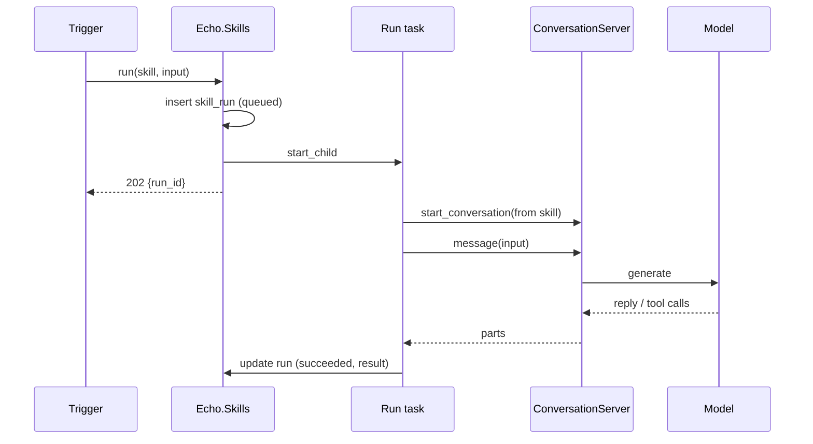
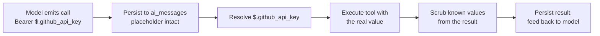
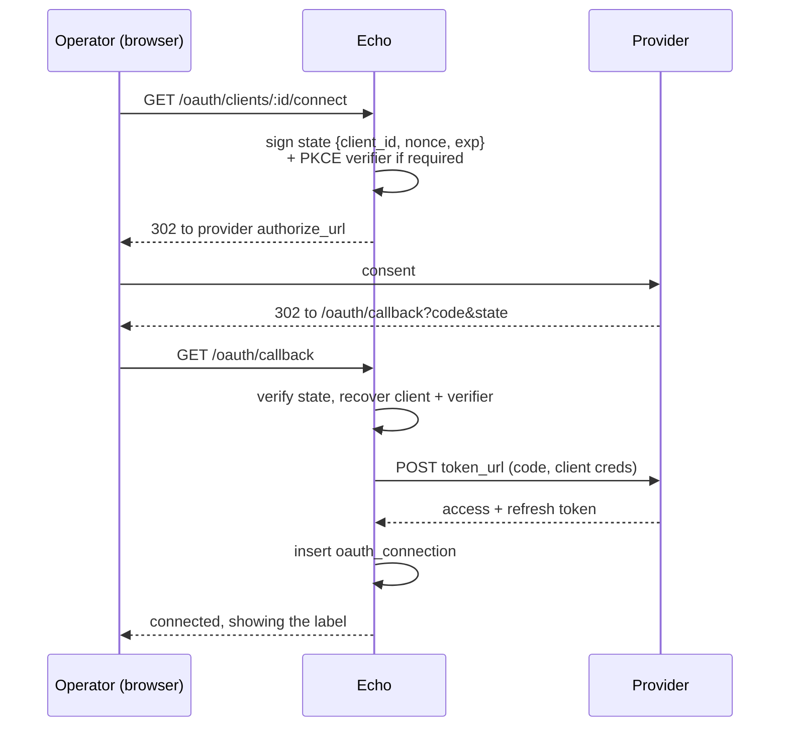
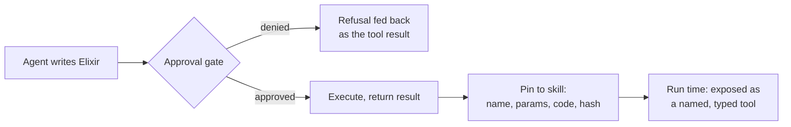

# Skills: repeatable agent work, authored by an agent

> **Status: Phase 1 is built** (skills, runs, variables, the run endpoint and
> late `$.name` substitution); Phases 2–9 are proposed. Supersedes the earlier
> `designs/agents_builder.md`, which proposed DB-defined agents with
> HTTP-endpoint tools, was never implemented, and has since been deleted — the
> pieces of it worth keeping are folded in below.

## Context

Echo can hold a conversation with a model that calls tools, and that
conversation now survives a restart. What it cannot do is package a piece of
work so it can be run again later, by something other than a person typing.

`Echo.Agents.Presets` is the closest thing already in the tree: a named system
prompt bundled with its tools and generation settings, exposed at
`POST /api/v1/ai/agents/:name`. But a preset is a module attribute compiled
into the binary (`lib/echo/agents/presets.ex:15`, `:169`), so adding one is a
code change and a deploy, and only Echo's own developers can write one.

A **skill** is a preset that lives in a row: markdown instructions, a list of
tools it is allowed to use, and generation config. It is authored by talking to
a builder agent rather than by editing Elixir, test-run under supervision while
the author approves anything dangerous, and later fired by a trigger.

**Decisions:**

1. **Approval is per-tool configuration, not a runtime policy engine.** A tool
   can be marked as one that stops rather than runs; the call comes back for a
   human decision, exactly as a client-side tool does today, and the decision
   returns through the conversation's own content route rather than an endpoint
   of its own. There is no approval mode, no policy evaluation, and nothing to
   catch — the model is only ever offered the tools the skill declared. A
   finished skill may keep gated tools: a parked run is an ordinary
   conversation and is resumable in the UI. See
   [The approval gate](#the-approval-gate).
2. **The tool list is a column, and a human is always in the loop when it
   changes.** The markdown body carries instructions and may well name
   parameters for the agent to use — best-effort, and fine. What a skill may
   invoke is a security boundary, so it is never parsed out of prose an agent
   wrote. The builder agent can *propose* a grant, because `update_skill` is
   itself a gated tool and the proposal stops for a decision; it cannot make
   one. A skill file's `tools:` line is likewise a grant an operator makes by
   importing it, and no builder tool may import one. See
   [Who may change a tool list](#who-may-change-a-tool-list).
3. **The builder is an agent with server-side tools**, registered in the
   existing `Echo.Agents.Tools` backend registry (`lib/echo/agents/tools.ex:14`),
   so it inherits the tool loop, persistence, and the approval gate for free.
4. **Runs are Elixir tasks, and a task ends when the work does.** No job
   library, no retries, no queue. A run that parks on a gated call ends its
   task and gets a new one when it resumes, so a run is one task per stretch of
   unattended work rather than one task from start to finish. Deployment is
   single-replica, so there is no contention to design around. Durability is a
   deliberate trade, not an oversight: the point of this build is to find out
   whether the idea works at all, the host is stable, and releases are
   infrequent enough that abandoning the occasional in-flight run costs less
   than a job runner would.
5. **Approval resumes through the conversation resume that already exists.**
   A paused run needs no separate durable state: the model's `functionCall` is
   already in `ai_messages`, and `ConversationServer.init/1` rebuilds a
   conversation from Postgres (`lib/echo/agents/conversation_server.ex:79`).

## What a skill is

Three tables in Phase 1 — `skills`, `skill_runs`, `skill_variables` — and
everything else is the conversation machinery that already exists. The rest
arrive with the phase that needs them: `skill_code_blocks` in Phase 4, and
`skill_triggers` in Phase 7, which is left unspecified until then.

`skill_runs.trigger_id` is a plain `bigint` until Phase 7 creates the table it
points at, so Phase 1 migrates on its own.

```
skills
  id            bigserial, primary key
  slug          text, unique        -- ^[a-z0-9]+(?:-[a-z0-9]+)*$, how a
                                    --  trigger names it
  name          text
  description   text                -- what it does, for listing and picking
  instructions  text                -- the markdown body: the actual SKILL.md
  tools         {:array, :text}     -- approved tool names (see below)
  provider      text                -- set at creation, never updatable.
                                    --  nil means Gemini, per Echo.Agents.Providers
  model         text                -- updatable, within that provider
  gated_tools   {:array, :text}     -- Phase 2. Which calls stop for a human
                                    --  instead of
                                    --  running: "http_request" for every call,
                                    --  "http_request:mutations" for the writes
                                    --  only. See the approval gate
  temperature   float
  max_output_tokens integer
  enabled       boolean             -- false stops triggers from firing it;
                                    --  a manual run still works, so a skill can
                                    --  be taken off its schedule and still tested
  timestamps
```

`tools` is a list of **names**, not declarations, because every tool a skill can
reach is defined somewhere else already:

| Kind | Named as | Declaration comes from |
|---|---|---|
| Echo tools | `http_request` | `Echo.Agents.Tools` → `tool_config/2` |
| Provider built-ins | `google_search`, `openrouter:web_search` | `Echo.Skills.SkillTools`, per provider |
| Pinned code blocks | the block's `name` | `skill_code_blocks.params_schema`, Phase 4 |

A skill has no client, which is what makes this sufficient.
`ai_conversations.tools` has to hold arbitrary declaration maps because Blogs
declares `edit_text` / `insert_lines` for *itself* to execute and Echo passes
them through untouched. A skill runs unattended: there is nobody on the other
end to run a client-side tool, so a skill never needs to store a declaration
it did not already have code for.

Starting a conversation from a skill therefore renders the tool list for the
skill's provider rather than copying it — the same `Tools.tool_config/2` call
`EchoWeb.AgentChatController` already makes (`lib/echo_web/controllers/agent_chat_controller.ex:239`).

Three things follow, and each of them is a bug avoided rather than a nicety:

- The file projection round-trips exactly, in both directions, because
  `tools: [http_request]` is the storage rather than a lossy rendering of it.
- Phase 5's tool intersection becomes a set operation on strings. Comparing
  nested declaration maps structurally is a privilege boundary implemented as
  deep equality, which is where subtle holes live.
- "Approve and remember" appends one string.

### Provider is fixed at creation

**A skill's provider can never change.** Note that storing names rather than
declarations is *not* what makes this necessary — rendering late would survive a
provider switch just fine, syntactically. The reason is capability parity.

Echo's own tools are portable: one canonical declaration, rendered into whatever
dialect the provider wants. Built-ins are not. `google_search` and
`openrouter:web_search` are not one capability under two spellings — they are
different services, reached differently, reporting differently
(`groundingMetadata` versus `annotations`). There is no honest mapping between
them, and a grant list that is portable in one half and not the other is worse
than one that is not portable at all: it would move a skill to a new provider
while silently dropping or substituting part of what it was approved to do.

So the lock is about what a skill may *do*, not about how its tools are spelled.
That reason holds whatever the column ends up storing.

This mirrors conversations, where the provider is fixed at creation and read
back from the record on every resume rather than from `opts`, for the same
reason: a provider that can drift is a provider that will
(`lib/echo/agents/providers.ex:5-8`). To change a skill's provider, create a
new skill.

`model` stays updatable — swapping models within one provider is routine and
changes nothing about tool syntax.

Immutability is enforced, not merely intended, through the same changeset split
the variables use (see [Two writers, one row](#two-writers-one-row)):

- **`create_changeset`** casts `provider` along with everything else.
- **`update_changeset`** does not cast `provider` at all, so no API shape, form
  field, or builder tool can reach it.

`Echo.Content.Blog` already does this to keep `content` out of metadata updates
(`lib/echo/content/blog.ex:52`), which is why `PUT /blogs/:id` can safely ignore
a `content` key rather than having to reject it.

A third path writes `gated_tools` alone: "approve and remember" drops an entry
mid-run (see [The approval gate](#the-approval-gate)). It narrows what stops for
a human and touches nothing else — in particular it never widens `tools`.

```
skill_runs
  id            bigserial, primary key
  skill_id      references skills
  trigger_id    bigint, nullable    -- null for a manual run. Plain column in
                                    --  Phase 1; the FK to skill_triggers is
                                    --  added in Phase 7 when that table exists
  session_id    text, nullable      -- the ai_conversations / ai_messages id.
                                    --  Null until the run's task has started a
                                    --  conversation: start_conversation/1
                                    --  generates the id, so the row cannot know
                                    --  it at insert
  status        text                -- queued | running | awaiting_approval
                                    --  | succeeded | failed
  input         map                 -- trigger payload, or the user's instruction
  result        text                -- the final assistant text
  error         text
  started_at, finished_at
  timestamps
```

The run row is a log and an index, not a state machine anyone recovers from.
The conversation is where the actual work is recorded, and `session_id` is the
join to it.

```
skill_variables            -- declaration and value, written by two paths
  id            bigserial
  skill_id      references skills
  name          text     -- ^[a-z_][a-z0-9_]*$, referenced as $.name
  kind          text     -- config | secret
  type          text     -- string | number | boolean
  description   text     -- shown to the model and to whoever fills it in
  required      boolean
  position      integer  -- stable ordering for forms
  value         text     -- the literal. A secret's is plain text for now;
                         --  encrypting this column is a later change, and a
                         --  contained one, since only Echo.Skills.Variables
                         --  reads it and the API never renders it
  timestamps
```

**Variables belong to the skill, not to a run.** One value, shared by every run
of it. There is no per-run override and no `input` kind: a run's own text
reaches the transcript by being substituted into the system prompt instead (see
[Running a skill](#running-a-skill)), which keeps the two namespaces disjoint.

That is also why a conversation's scope names the **skill** — `"skill:12"` —
rather than the run.

See [Variables and secrets](#variables-and-secrets) for how these are resolved.

Instructions follow the blog convention of splitting content from metadata
(`lib/echo/content.ex:70`, `lib/echo/content/blog.ex:52`) so that editing a
skill's body is a distinct operation from renaming it — worth having when the
thing writing the body is a model. Revisions are not in scope for Phase 1 but
the split is what makes adding them later cheap.

### Rendering a skill as a file

A skill is exportable as one markdown file, frontmatter plus body, so it can be
read, diffed, and pasted between systems:

```markdown
---
name: weekly-dependency-report
description: Checks our dependencies for new releases and writes a summary.
tools: [http_request]
gated_tools: [http_request:mutations]
model: openai/gpt-5.6-luna
provider: openrouter
---

Fetch the latest release for each dependency listed below and summarise
anything that changed...
```

This is a **projection**, in both directions: importing a file writes the
columns. The columns remain authoritative at run time, so a hand-edited
`tools:` line in an exported file grants nothing until it has been imported and
saved.

Because `tools` stores names, the frontmatter can carry the same names the
column does and a skill round-trips through a file without loss. That is a
convenience of the format, **not** a relaxation of decision 2: the column is
still the only thing consulted at run time, and importing a file is an operator
granting those tools, exactly as if they had ticked them in a form. No builder
tool may import a skill file — an agent that could write frontmatter and then
import it would be writing its own grants, which is the precise thing decision 2
exists to prevent.

Import validates: a name that is not a registered Echo tool, a built-in the
skill's provider does not offer, or a pinned block that does not exist is
rejected rather than stored. `provider` is honoured on create and ignored on
update, per [Provider is fixed at creation](#provider-is-fixed-at-creation).

A **missing** `gated_tools:` line means nothing is gated, which on import is a
widening rather than a no-op. That is the one place the projection can quietly
grant more than the file appears to say, so an import that finds `tools:` and no
`gated_tools:` should say so rather than assume.

## Running a skill

A trigger creates a `queued` run, spawns a task, and returns the run id. It
never waits for the model. The existing message path blocks for up to 300s
(`lib/echo/agents/conversation_manager.ex:70`), which is fine for a person at a
keyboard and useless for a webhook.



Starting the conversation is `ConversationManager.start_conversation/1`
(`lib/echo/agents/conversation_manager.ex:37`) with the skill's columns as
opts: `system_prompt` from `instructions`, plus `tools`, `provider`, `model`,
and the generation settings. The skill's markdown becomes the system prompt
verbatim.

Because runs are tasks with no supervision beyond the node, **a restart mid-run
leaves the row stuck in `running`.** That is accepted, not solved: the
conversation itself is durable and readable, so nothing is lost but the status.

## The approval gate

**A tool call that needs a decision stops instead of running.** The operator
answers it, and the conversation carries on. That is the whole mechanism.

Echo already has most of the path. A call the conversation cannot execute itself
falls through untouched and comes back to the caller — that is how the blog
editor's client-side `edit_text` works today. A gated call takes the same road:
it is not executed, the turn ends, and the process is freed. Nothing holds a
process open across human time.

The model is only ever offered the tools the skill declared, so nothing has to
be *caught*. There is no approval mode and no policy engine.

### One transport

An approval arrives the same way every other message does, on the conversation's
existing content route:

```
PUT /api/v1/ai/conversation/:id/content

{"content_blocks": [{"toolApproval": {"id": <call>, "decision": "approve"}}]}
{"content_blocks": [{"toolApproval": {"id": <call>, "decision": "deny",
                                      "reason": "..."}}]}
```

An earlier draft of this design gave approve an endpoint of its own and left
deny as a `functionResponse` on `/content`. That asymmetry was arbitrary — both
are the operator answering a question the conversation asked. One route means
one authenticated path, and it inherits the transparent resume that route
already has, so a conversation whose process is gone is rehydrated on the way
in.

It also keeps a door open. Everything entering a conversation through one place
is what makes a streaming transport — Phoenix channels over the same content
path — a later addition rather than a rewrite.

A companion read tells the UI what is waiting:

```
GET /api/v1/ai/conversation/:id/pending
```

Pending calls are derived from history rather than held in memory: a call with
no answering response has not been decided. The model's `functionCall` is
persisted before the loop continues, so this is durable by construction and
still correct after a restart.

### The decision is recorded; the block is not

The approval block is consumed, never persisted as a part of the conversation.
A new part type would be replayed into the model's context on every later turn,
and the model would spend the rest of the conversation reading approval
bookkeeping.

Instead Echo authors the part that reaches the model — the tool's real result on
approve, a refusal it can react to on deny — and records who decided what as
**metadata on that row**. The audit trail sits on the row it produced, and the
model's view of history stays clean.

Two consequences are worth stating, because both are security properties rather
than conveniences:

- **The request carries only the call's identity, never its arguments.** Echo
  re-reads the call from history and runs that, so an approval can never
  execute something other than what the operator was shown.
- **The approval UI shows placeholders, not values.** Arguments are persisted
  before substitution (see [Variables and secrets](#variables-and-secrets)), so
  a pending call reads `$.github_api_key` and structurally cannot display the
  secret.

### What parks a call

The tool classifies a call; the skill decides whether that class stops.

A tool answers one fixed question about a call — whether it mutates anything —
next to the code that actually knows. `gated_tools` then says what to do with
the answer:

| Entry | Parks |
|---|---|
| `http_request` | every call to that tool |
| `http_request:mutations` | only the calls it classifies as mutating |
| *absent* | nothing; the tool runs unattended |

"Reads flow, writes stop" is the middle row, and it is the useful setting for
most skills — gating `http_request` outright would mean a click for every page
fetch. The last row matters just as much: a scheduled skill that must write has
to be able to, or Phases 8 and 9 deliver nothing.

Splitting classification from policy is what keeps this configuration rather
than a policy engine. The classification is fixed and closed; the row picks from
a small set and never carries an expression.

**Later, a tool will carry its own configuration on a skill** — an
`http_request` restricted to named hosts, say — so a call inside those bounds is
pre-authorised and one outside them parks. That is the same idea continued, and
a skill feature in its own right. It is deliberately not in the phases below.

### A gated call parks its whole turn

If a turn asks for two calls and one of them is gated, neither runs.

Answering some of a turn's calls and not others is a shape Gemini tolerates and
OpenRouter rejects outright: an assistant message with two `tool_calls` followed
by one `tool` message is invalid for OpenAI-compatible endpoints. Worse, it
would fire a real side effect while waiting on a decision about its neighbour.

Approval stays per call — the operator answers each one — and the turn resumes
only once every pending call in it has an answer.

### Approve and remember

**Approve and remember** is one column edit: drop the entry from the skill's
`gated_tools`. Note what it is *not* — it never widens `tools`, because the
model could not have called something outside that list in the first place. A
skill gains a tool only when an operator or the builder agent adds one.

`remember` therefore has no meaning on a conversation with no skill behind it,
which the plain agent chat is. There it is simply unavailable.

### Waiting is a normal state, not a failure

A skill run whose turn ends on a gated call moves to `awaiting_approval` and its
task ends. Nothing holds a process open across human time.

That run is not stranded. It is an ordinary conversation with its own
`session_id`, readable and resumable in the UI like any other, so a finished
skill may absolutely carry gated tools — a nightly job that parks on its one
dangerous call and waits to be looked at is a reasonable thing to want, not a
misconfiguration.

### Who may change a tool list

The builder agent writes skills, and a skill's tool list is its blast radius —
so the tool that edits that list is itself gated. `update_skill(skill, tools:
[...])` comes back as a pending call with its arguments visible, an operator
reads exactly which grant is being proposed, and approving it applies the
change. The agent proposes; it never grants.

This is deliberately *not* a separate mechanism. An earlier draft of this design
reached for a changeset split — an agent-reachable changeset that cannot cast
`tools` — but that is a second security boundary doing a worse job than the one
already here: it draws the line at a column rather than at a specific proposed
change, so it can only answer "may an agent ever touch this", never "is *this*
grant reasonable". Gating shows the operator the actual arguments, and both the
proposal and the decision land in `ai_messages`.

Two rules make it hold:

**The builder's own gates live in its preset, which is code.** `skill_builder`
declares `create_skill` and `update_skill` and marks them gated in
`Echo.Agents.Presets`. A compile-time module attribute is the thing this design
opens by complaining about, and here it is exactly right: nothing an agent does
can reach it, so the gate on the gate is not itself a row.

**Skill-writing tools never appear in a skill's own tool list**, gated or
otherwise — the same rule `run_elixir` has. A skill granted `update_skill` is
one careless approval away from rewriting its grants unattended from then on.

The split in [Two writers, one row](#two-writers-one-row) still stands for
variable *bindings*, and the difference is the point:

- **Gate** what a human can meaningfully review: a proposed grant, arguments in
  full view.
- **Withhold** what an agent should never be able to name at all: which secret
  fills a variable. Gating `bind_variable` would work mechanically, but "the
  agent never learns secret ids exist" is a stronger property than "the agent
  proposes and a human checks."

## Variables and secrets

A skill declares the variables it needs, and the builder agent writes that
schema alongside the instructions. Two kinds:

| Kind | Reaches the model | Rendered by the API | Example |
|---|---|---|---|
| `config` | in a tool result, like anything else | yes | `$.repo_name` |
| `secret` | never — replaced by its placeholder on the way back | never, only whether it has a value | `$.github_api_key` |

Both live on the skill and are set once by an operator. The agent references
them by name in a tool argument — `$.github_api_key` — and the placeholder is
resolved **server-side, immediately before the tool runs**.

**A variable never resolves in the instructions.** A skill body reading
`"Report on $.repo_name"` reaches the model with the placeholder intact. That
looks like a limitation and is the point: the system prompt is stored once and
replayed into every subsequent model request, so a value expanded there would be
re-sent for the life of the conversation. What the model gets instead is a block
naming the variables that exist, with their kinds and descriptions.

**A secret's value is stored in plain text today.** Encrypting
`skill_variables.value` is a later change and a deliberately contained one:
`Echo.Skills.Variables` is the only reader, and the API already renders nothing
but `bound: true`. Getting the shape right first is worth more than encrypting
a shape that is still moving.

### Two writers, one row

The builder agent declares what a skill *needs*. Only an operator says what
actually fills it. Those are different privileges: a tool that could do both
could write a skill its own credentials, which is the same privilege-escalation
shape as a sub-agent granting itself its parent's tools.

So `skill_variables` is written through two changesets, following the split
already used for blogs (`lib/echo/content/blog.ex:52`, where content is only
writable via `Echo.Content.update_blog_content/2`):

- **`declaration_changeset`** casts `name`, `kind`, `type`, `description`,
  `required`, `position`. This is what the builder agent's tool reaches.
- **`binding_changeset`** casts `value`, and is reachable only from the operator
  API and UI. No agent tool calls it.

An agent can therefore say *"this skill needs a GitHub token with repo scope"*
and cannot say what that token is.

One narrow exception exists so the split cannot be walked around: redeclaring a
`secret` as a `config` clears the value. Declaration is agent-reachable, so
without it an agent could expose a stored secret by rewriting its kind rather
than by reading it. The reverse direction keeps the value, since it only adds
protection.

### Defining the schema

The builder agent gets one tool, `define_variables(skill, variables)`, which
replaces the whole declaration set rather than patching it. Declarative is
easier for a model to get right than a sequence of add/update/remove calls, and
it is idempotent when the agent retries.

Replacement keeps bindings for variables whose `name` survives unchanged, and
drops bindings for variables that disappear. The tool result says which
bindings were dropped and which new variables are unbound, so the agent can
tell the operator what still needs filling in — and a skill with unbound
required variables cannot run.

### The model never sees a secret's value

This is the property the whole design hangs on, and it has a specific reason.
Conversation history is persisted to `ai_messages` and replayed into *every*
subsequent model request (`replay_into_turns/1`,
`lib/echo/agents/conversation_server.ex:304`). A secret expanded into a tool
call would therefore be written to Postgres and re-sent to the provider on
every turn for the rest of the conversation. Expanding secrets into the system
prompt is worse for the same reason.

So substitution happens at the last possible moment and is not recorded:



The arguments stored in `ai_messages` keep the placeholder. Only the in-memory
map handed to `Echo.Agents.Tools.run/1` carries the real value, and it is never
written back.

**Sensitive results are scrubbed on the way in.** A tool can echo a secret back
without meaning to — an error message quoting the failing URL, a redirect
target, a response body reflecting a header. Before a `functionResponse` is
persisted or shown to the model, the resolved values used in that round are
replaced with their placeholders.

Only values a resolver marks **sensitive**, though, and that distinction is
load-bearing rather than fussy. Replacing every resolved value would corrupt
results rather than protect anything: a `config` variable holding `"1"` would
rewrite every `1` in every tool result, silently, and nothing downstream could
tell. Phase 1's `config` and `input` variables are all `:plain`, so scrubbing is
a tested no-op until Phase 6 produces something that is not.

This is a backstop, not a guarantee: a secret the tool transforms —
base64-encoded, hashed, embedded in a longer token, or cut in half by a
response-size cap — will not match and will not be caught. It also does not
cover *logs*, which are a different sink entirely; `http_request` strips the
query string and userinfo from the URL before writing it.

### Declaring, validating, failing early

The variable names, kinds, and descriptions are injected into the system prompt
so the agent knows what exists; values never are. A call referencing an
undeclared name comes back as an error result the model can react to, in the
same style as the other tool failures.

Required variables are checked **before the first model call**, when a run
starts. A skill missing its API key should fail immediately with a clear
message, not burn a turn and then fail inside a tool.

The approval UI shows placeholders, exactly as the model wrote them, so
approving a call never displays a secret.

### Interaction with pinned code

Approved code blocks resolve variables in their arguments the same way, so a
block can hold a secret in a local binding. That is intentional — the code is
human-reviewed — but it means a block *can* return a secret, and scrubbing is
what stands between that and the transcript. Blocks that touch secrets deserve
a closer read at approval time than blocks that do not.

## OAuth2 clients and connections

> **Parked, and possibly for good.** Not a phase, not scheduled, and no
> `kind: oauth` exists. Most integrations do not need it: a GitHub PAT, a Stripe
> key, a Linear API key are all just `secret` variables. What follows is the
> analysis as it stood, kept because it is the expensive part to redo — if a
> provider ever refuses to issue a long-lived key, start here rather than from
> nothing. Nothing else in this document depends on it.

OAuth2 is for when a provider will not issue a long-lived key, or when Echo must
act as an account rather than as itself. It is a separate subsystem, not a
variety of secret.

It has three layers, and conflating them is the usual way this goes wrong:

| Layer | Who does it | How often | Produces |
|---|---|---|---|
| Register the app | operator, on the provider's site | once per provider | `client_id` + `client_secret` |
| Authorize a connection | operator, through a browser flow | once per account | access + refresh token |
| Use and refresh | Echo, at run time | every call | a valid bearer token |

Only the first is manual and out-of-band: someone opens GitHub's developer
settings, creates an OAuth app, pastes the redirect URI Echo shows them, and
brings back a client id and secret. Nothing automates that, and nothing should
pretend to.

```
oauth_clients              -- the registered app
  id
  provider          string, unique    -- github, google, notion
  display_name      string
  client_id         string
  client_secret     binary            -- encrypted
  authorize_url     string
  token_url         string
  default_scopes    {:array, :string}

  -- Provider quirks, as config rather than code. See the costs section.
  auth_style        string   -- basic | body: where client creds go
  scope_delimiter   string   -- " " for most, "," for GitHub
  uses_pkce         boolean
  timestamps

oauth_connections          -- one authorized account
  id
  oauth_client_id   references oauth_clients
  label             string   -- which account this is, for the UI
  access_token      binary   -- encrypted
  refresh_token     binary   -- encrypted, null when the provider issues none
  expires_at        utc_datetime, nullable   -- null means it does not expire
  scopes            {:array, :string}
  status            string   -- active | needs_reauth | revoked
  last_refreshed_at utc_datetime
  timestamps
```

### It reuses the variable machinery

A connection is reached exactly like a secret: a skill declares a variable of
`kind: oauth` with the provider it wants, an operator binds it to a specific
connection, and `$.github` resolves at tool-execution time to a valid bearer
token that is never written to the transcript. All of
[Variables and secrets](#variables-and-secrets) applies unchanged — late
substitution, scrubbing on the way back, placeholders in `ai_messages`.

The write boundary holds too, and matters more here. The agent declares *"this
skill needs a GitHub connection with `repo` scope"*. It cannot choose which
account that is.

### How the agent knows an app exists

A read-only tool, `list_integrations`, returns for each provider: whether a
client is registered, which connections exist by label, and what scopes each
holds. No ids that grant anything, no tokens. This is a tool rather than
something injected into the system prompt because the answer changes between
runs and the builder should look it up when it becomes relevant.

It lets the builder say "there is already a GitHub app, and a connection
labelled `Shonei` with `repo` scope, so I will declare a variable for it"
instead of proposing that you go and create an app you already have.

### Connecting



The redirect URI is **one fixed path**, `/oauth/callback`, because it has to be
registered with the provider ahead of time. Which client a callback belongs to
comes from the signed `state`, which also carries a nonce and an expiry so the
callback cannot be replayed or forged. PKCE verifiers ride alongside it for
providers that require them.

### Refreshing

On resolve, a connection whose `expires_at` is inside a small skew window is
refreshed before use. Two details matter more than the mechanics:

**Concurrent refresh must be serialized.** Two tool calls in one turn can
resolve the same connection at once, both refresh, and — with any provider that
rotates refresh tokens — the loser's token is already invalid, permanently
breaking the connection. Refresh therefore happens inside a transaction holding
`SELECT ... FOR UPDATE` on the connection row. A per-connection GenServer would
match the house style (`Echo.Agents.ConversationRegistry` does exactly that),
but the row lock is simpler and stays correct if a second replica ever exists.

**Refresh failure is terminal, not retryable.** A revoked grant or an expired
refresh token sets `status: needs_reauth` and fails the run with a message
naming the connection. It does not retry, and it does not fall through to an
unauthenticated call.

### The UIs

Three screens, all behind the existing browser basic auth:

- **Clients** — list, create, edit. Shows the redirect URI to paste into the
  provider, and never renders `client_secret` after it is saved.
- **Connections** — per client: labels, scopes, expiry, a `needs_reauth` badge,
  and connect / reconnect / disconnect. This is where a broken integration
  becomes visible, so it is the screen that matters when a 3am run fails.
- **Binding** — on the skill, the operator picks which connection fills each
  `kind: oauth` variable. The same screen binds secrets.

## Pinned code blocks

The goal is for the agent to write Elixir and have it run. The problem is that
the BEAM has no sandbox — process isolation is for failure, not security. Any
process can reach `File`, `System.cmd`, `Echo.Repo`, and `Application.get_env`,
where every API key lives. Three things have no in-VM defence at all:
`:erlang.halt/0` stops the node, `String.to_atom/1` in a loop permanently
degrades the VM by exhausting the atom table, and `System.cmd/3` shells out.
Filtering the AST for these is a losing game: `apply/3`, dynamic dispatch,
macros, and the whole `:erlang` module make the escape surface unbounded.

**So arbitrary code never runs at run time. Only reviewed code does.**

Approval already exists for exactly this shape of decision, so code reuses it:



The two halves are deliberately different tools:

- **`run_elixir`** takes `code` and `args`. It lives in the `skill_builder`
  preset's tool list and in no skill's, and is always gated — so it is the
  ordinary two-part server tool from [The approval gate](#the-approval-gate):
  the call comes back with the code as its argument, a human reads it, and
  approving it makes Echo execute it. Because a skill's tool list can never
  contain it (see [Who may change a tool list](#who-may-change-a-tool-list)), a
  running skill cannot express "execute this code" at all.
- **Each pinned block** is offered at run time as its own function declaration,
  with its own name, description, and parameter schema. The model calls
  `compute_totals(orders: [...])` — it supplies arguments, never code.

This is the `agents_builder.md` idea of user-defined tools, with Elixir in
place of configured HTTP endpoints, and with a human approval as the gate.

```
skill_code_blocks
  id
  skill_id      references skills
  name          string   -- ^[a-z_][a-z0-9_]*$, becomes the tool name
  description   text     -- shown to the model
  params_schema map      -- canonical JSON Schema, as Echo.Agents.Tools uses
  code          text
  code_hash     string   -- what was approved; execution requires a match
  approved_at   utc_datetime
  timestamps
```

Code is evaluated with the validated arguments bound to `args`, and the result
encoded into the `functionResponse`. Failures come back as a result the model
can read and react to, the way `Echo.Agents.Tools.HttpRequest` already returns
its errors rather than raising (`lib/echo/agents/tools/http_request.ex:73-85`).

**This phase needs a runtime dispatch path, which does not exist yet.**
`Echo.Agents.Tools` is a compile-time registry, and three separate places assume
every tool is in it: `enabled/1` and `executable_calls/2` both test
`Map.has_key?(@backends, name)`, and `run/1` does `Map.fetch!(@backends, name)`
(`lib/echo/agents/tools.ex:47`, `:73`, `:92`). A pinned block is a per-skill row,
so none of those find it.

The failure mode if this is missed is quiet and misleading: the block is declared
to the model, the model calls it, `executable_calls/2` does not recognise the
name, and the call falls through to the caller — indistinguishable from a gated
tool waiting on a human. So the registry needs a second, row-backed lookup
consulted after `@backends`, and the three call sites need to go through it.

Runaway code is the failure mode that *does* have in-VM answers, and both are
used: the block runs inside a task carrying
`Process.flag(:max_heap_size, %{size: _, kill: true})`, and the caller uses
`Task.yield/2` with a `Task.shutdown(task, :brutal_kill)` fallback. That covers
memory bombs and infinite loops. It does not cover `halt`, atom exhaustion, or
shelling out — those remain possible for any code a human approves, which is
the residual risk this design accepts rather than solves.

## Sub-agents

The value is context isolation. A skill that needs to read twenty pages to
answer one question should not carry all twenty into its own history — it hands
the job to a child, and gets back the answer instead of the transcript.

A sub-agent is an ordinary conversation, so it is persisted and readable at
`/ai-messages` like any other, with its own `session_id`. The parent's
`functionResponse` records only the child's final text; the working is kept but
kept out of the parent's context.

Three constraints, none of which the existing tool loop gives for free:

**A child may never hold a tool its parent lacks.** Otherwise `spawn_agent` is
a privilege-escalation primitive: a skill granted only `http_request` could
spawn a child granted `create_skill` and rewrite its own grants. The child's
tool set must be intersected with the parent's, server-side, never from an
argument the model supplies.

Intersect against the **skill's** `tools` — names, so it is a set operation on
strings — reached through the run row, which joins `session_id` to `skill_id`.
Not against `ai_conversations.tools`, which still holds provider-shaped
declaration maps for the sake of client-declared tools; comparing those
structurally would be a privilege boundary implemented as deep equality on
nested maps. A child also inherits the parent's `gated_tools`, or gating would
be escapable by delegation.

**Recursion needs its own ceiling.** `@max_tool_iterations` caps calls per turn
(`lib/echo/agents/conversation_server.ex:11`), not nesting depth — a child
spawning a child is a fresh conversation with a fresh counter. Depth must be
tracked on the conversation and capped, with `spawn_agent` removed from the
tool set at the last permitted level rather than erroring at it.

**The parent blocks while the child runs, and now has a budget to share.** A
turn carries one deadline (`@turn_budget_ms`, 270s) that every model call inside
it draws down, so the parent's remaining time is a real number rather than an
unbounded sum of per-call timeouts. A child must be given a slice of what is
left and must not be started when too little remains — otherwise the child
consumes the parent's budget and the parent returns having done nothing with it.

That is the whole of what Phase 5 has to decide here. The older and worse
problem — a turn whose inner budget could exceed the `GenServer.call` waiting on
it, so the caller got a 500 for work that had completed and was durable — is
fixed; the deadline is where the fix lives.

The remaining option, if a child ever needs more than a slice of one turn, is to
make sub-agent calls asynchronous: the parent parks and resumes exactly as the
approval gate does. That composes with everything here and stays a later choice
rather than a Phase 5 decision.

## Phases

**Phase 1 — Skills as data. Built.** `skills`, `skill_runs`, and
`skill_variables` tables and contexts, CRUD API under `/api/v1/skills`, and
`POST /api/v1/skills/:slug/run` returning `202` with the run. A
`Task.Supervisor` joins the supervision tree next to the conversation registry.
A hand-written skill row can be run, and its conversation read back at
`/ai-messages`. See `docs/skills_api.md`.

Variables are here rather than with secrets because a skill without parameters
is barely a skill, and because building substitution and scrubbing once —
against `config` and `input` variables, which are not sensitive — means the
security-critical plumbing is written and tested *before* there is anything
secret flowing through it. Phase 6 then encrypts the column behind the resolver
Phase 1 already calls, and changes nothing else.

**One thing this design did not anticipate: the pointer has to go the other
way.** `skill_runs.session_id` names a run's conversation, but
`ConversationServer` needs the reverse — which run's variables to resolve — and
it cannot look that up. `ConversationManager.start_conversation/1` generates the
session id itself and runs `init/1` synchronously inside that call, so
`skill_runs.session_id` is still null when the first tool round executes; a
reverse lookup would appear to work only after a resume. It must also name the
**run**, not the skill, because `kind: input` values live on the run.

So `ai_conversations` carries a nullable `variable_scope`, an opaque
`"skill_run:<id>"` handed to whichever module answers
`Echo.Agents.VariableResolver` — read from config, since `Echo.Skills` already
calls `Echo.Agents` and naming it back would be a compile-time cycle. Null means
no variables, which is every conversation predating this and every plain agent
chat: no scope, no resolver call, no behaviour change.

Substitution and scrubbing live in `Echo.Agents.Tools.run_all/2` rather than in
the conversation's tool loop, so that Phase 2's approval path — which executes a
tool outside that loop — inherits both instead of having to remember them.

**Phase 2 — Gated tools.** A `gated_tools` column on `ai_conversations` and
`skills`; a tool's classification of its own calls, so `:mutations` means
something; pending-call derivation and a `/pending` read; the approval block on
the existing `/content` route; and the UI that shows a pending call and its
arguments. No new write endpoint — approve and deny both arrive the way every
other message does.

Independent of skills: it applies to any conversation, including the existing
agent chat, which can already call `http_request`. `remember` is the one part
that is skill-only, since there is no `gated_tools` list to edit on a
conversation with no skill behind it.

**Phase 3 — Builder agent.** `create_skill`, `update_skill`,
`update_skill_instructions`, and `define_variables` as backends in
`Echo.Agents.Tools`, plus a `skill_builder` preset at
`POST /api/v1/ai/agents/skill_builder` that declares them and marks the
grant-changing ones gated. Ordered after Phase 2 deliberately, and not merely
for tidiness: an agent that can write skills is exactly the thing that should be
gated from its first day, and Phase 2 is what makes that possible. None of these
tools can bind a variable to a secret — see
[Two writers, one row](#two-writers-one-row) and
[Who may change a tool list](#who-may-change-a-tool-list).

**Phase 4 — Pinned code blocks.** A gated `run_elixir` tool in the
`skill_builder` preset, whose approved code is pinned to the skill and
re-exposed at run time as named, typed tools. Carries the one piece of
groundwork this design needs and does not yet have: a row-backed tool registry
alongside the compile-time `@backends`. See
[Pinned code blocks](#pinned-code-blocks).

**Phase 5 — The sub-agent tool.** A `spawn_agent` backend that starts a fresh
conversation with a caller-supplied prompt and tool subset, runs it to
completion, and returns its final text as the `functionResponse`. Pure Echo
machinery, no external dependency; it composes what Phases 1–3 already built.
Independent of Phase 4, so the two can swap freely.

See [Sub-agents](#sub-agents) for the constraints, which are not obvious.

**Phase 6 — Encryption and the first real tools.** `skill_variables.value` is
plain text today. Encrypting it is contained — `Echo.Skills.Variables` is the
only reader and the API renders nothing but `bound: true` — so it is worth doing
once the shape has stopped moving rather than before.

The larger half of this phase is the integrations a stored key unlocks, which is
most of them. A skill that can only make anonymous HTTP requests cannot do much,
so capability comes before automation.

One tool here is a prerequisite rather than a nicety: **something a skill can
report through** — mail, chat, or an outbound webhook. A scheduled skill with no
output channel produces nothing anyone sees, so Phases 8 and 9 deliver very
little without it.

**Phase 7 — Triggers: manual and webhook.** The `skill_triggers` table, a
`create_trigger` builder tool, a UI button that takes an optional instruction,
and a webhook endpoint. The webhook reuses the `AcceptAny` + `CacheRawBody`
plugs from the existing echo sink so an HMAC can be computed over the exact
bytes received.

**Phase 8 — Cron triggers.** A self-scheduling GenServer in the house style of
`Echo.Requests.RequestCleanupJob`, which re-arms itself with
`Process.send_after/3` after each tick
(`lib/echo/requests/request_cleanup_job.ex:61-62`), ticking against a
`next_run_at` column.

## Costs and open questions

**A skill's tool list is its blast radius, and the builder writes skills.**
Phase 3 gives an agent a tool that creates things which themselves hold tool
grants. Gating covers the dangerous calls during authoring, but "approve and
remember" is a one-click decision to let a skill make that call unattended
forever after. The UI has to show the rendered declaration and the actual
arguments, not just the tool's name — and since `tools` stores names, that
declaration is rendered from `Echo.Agents.Tools` at display time rather than
read back from the row.

**The injection vector is content, not users.** Echo has one operator, and
nobody else can reach the UI or mint a token — so "a malicious user asks the
agent to misbehave" is not a threat here. What remains is everything the agent
*reads*: a webhook payload carries issue bodies and commit messages that anyone
can write, and a fetched page says whatever its author wanted. Phase 7 needs
the prompt-injection guard the editor preset already uses — payload is material
to act on, never instructions to follow (`lib/echo/agents/presets.ex:26-30`) —
and a skill's tool grants must never be derived from the payload that triggered
it.

This is also what makes [pinned code](#pinned-code-blocks) load-bearing rather
than merely tidy. Injected text cannot introduce code when code requires a
human-approved hash. If an escape hatch that evaluates arbitrary code at run
time is ever added, that property is gone and this section stops being true.

**A pinned block's arguments are still model-controlled.** Pinning fixes the
code, not the inputs. A block that takes a path and reads it hands path
selection to whatever the model was persuaded to pass. Blocks should validate
against their own `params_schema` and be written as if their arguments were
hostile, because under injection they are.

**Secret scrubbing is a backstop, not a guarantee.** Substituting late keeps
secrets out of the transcript on the way *out*; scrubbing tries to keep them
out on the way *back*. It works by matching the resolved value, so anything a
tool transforms — encoded, hashed, wrapped in a longer token, or split — passes
straight through into `ai_messages` and every later model request. The
substitution boundary is the real control; scrubbing only catches the obvious
echoes.

**"Generic OAuth2" is partly a fiction, and deliberately so.** RFC 6749 calls
itself an authorization *framework*; it leaves much of what a client needs to
know either optional or up to the server. Two different problems hide behind
that, and they want different treatment:

- **Legal variation**, which is permanent and belongs in config. `expires_in`
  is RECOMMENDED rather than required, refresh tokens are OPTIONAL, whether to
  rotate one on use is the server's choice, and client credentials MUST work
  via HTTP Basic but MAY also go in the body. The quirk columns on
  `oauth_clients` exist for exactly this set.
- **Violations**, which are provider bugs. Scope is specified as
  space-delimited (§3.3) and token responses MUST be JSON (§5.1); GitHub does
  neither by default. These should *not* become columns — a flag per provider
  bug is how that table reaches twenty columns. The first provider needing one
  gets a bespoke module instead.

`uses_pkce` should default to **true**. OAuth 2.1 folds PKCE in as mandatory
and drops the implicit and password grants, so building as if it were already
required costs nothing and dates better.

**A revoked credential is invisible until something uses it.** Nothing checks
whether a stored key still works, so a revoked one looks fine until the next run
fails on it. Given scheduled runs, that gap can be days. A periodic check is
straightforward once there is a scheduler in Phase 8; before that, a failed run
is the only signal.

**The model chooses where a secret goes.** It writes `$.github_api_key` into an
argument, and the server resolves it wherever it was written — which means a
model persuaded to put the placeholder in a URL query string, or in a request
to the wrong host, gets a real credential sent there. Substitution protects the
transcript, not the destination. Constraining that properly means per-variable
rules about which tool and which host may receive a given secret; it is not in
this design, and it is the first thing to add if a skill ever holds a
credential worth stealing.

**Webhook triggers need their own secret.** The API token store is an in-memory
GenServer that a restart wipes, and the existing `/api/v1/echo/*` sink is
unauthenticated by design — it is a request inspector, not a dispatcher. Its
plugs are reusable; its auth posture is not.

**No retries, no durability for in-flight runs — accepted.** A deploy mid-run
abandons the task and leaves the row `running`. The conversation itself
survives, so a stuck run can be inspected and re-driven by hand, and losing the
occasional one is cheaper than a job runner while the question is still whether
the idea works. The trade stops being right once a skill is doing something
whose loss actually costs money or correctness, and that is when Oban earns its
place — not before.

**Single replica is assumed.** Nothing here guards against two nodes running
the same cron tick or the same run. That assumption is load-bearing by Phase 8
and should be revisited before a second replica exists.

**A sub-agent is not a sub-skill.** Phase 5 lets an agent spawn a child by
handing it a prompt and a tool subset. It deliberately does *not* let a skill
invoke another skill by name. The first is a scoped call with a bounded depth;
the second is a call graph between named, separately-versioned, separately-
granted units, which is a workflow engine wearing a smaller hat. Worth refusing
until something concrete cannot be expressed without it.

**Open:** whether skills need revisions. The content/metadata split makes
adding them cheap later, and a model writing the body is a decent argument for
having them sooner.
